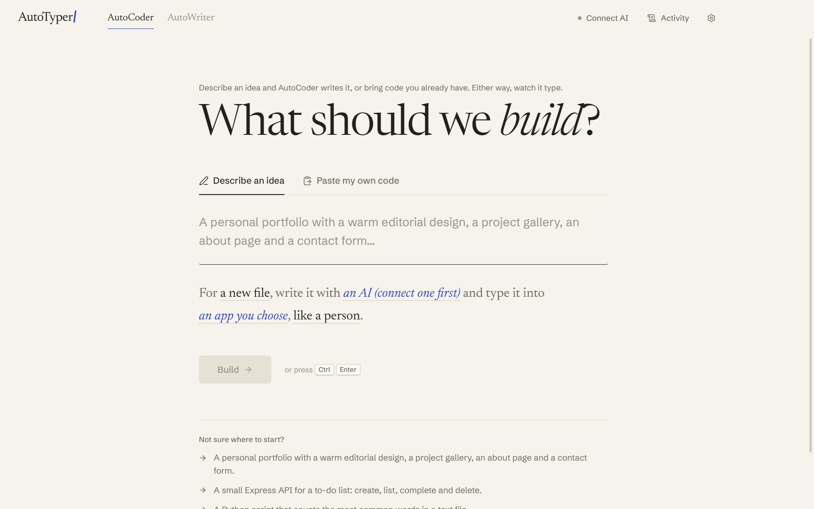
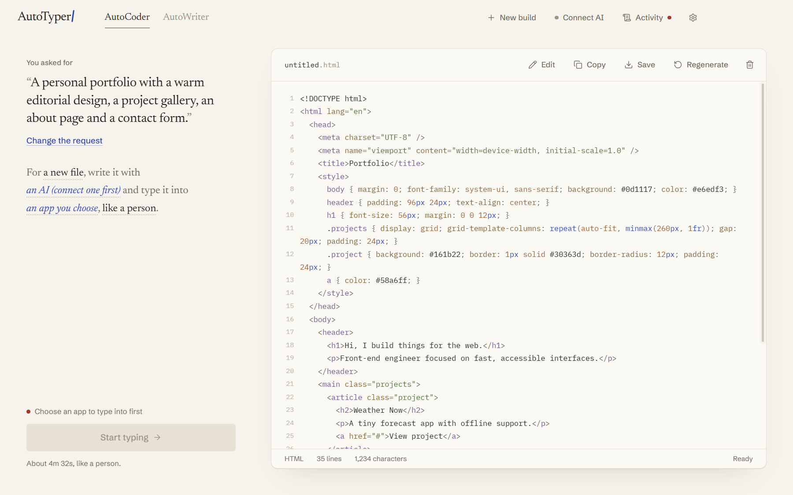
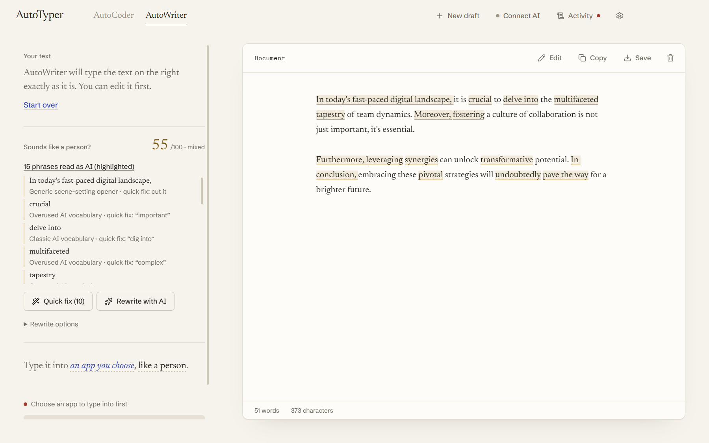
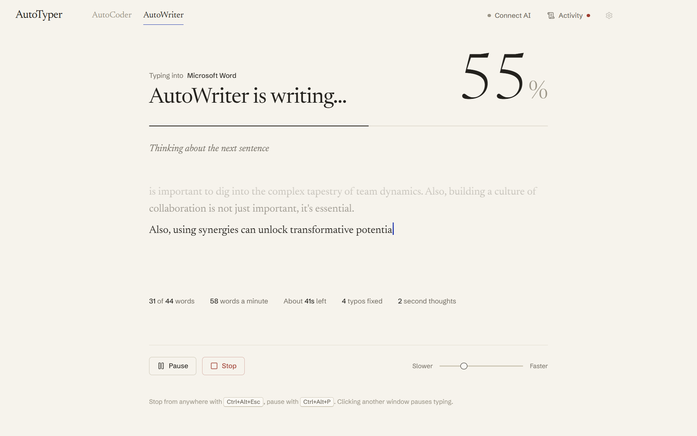

<p align="center">
  
</p>

<h1 align="center">AutoTyper</h1>

<p align="center">
  Types your code and writing into any app at a human pace.<br>
  Pauses, typos, second thoughts and fixes included.
</p>

<p align="center">
  <a href="LICENSE"></a>
  
  
</p>

<p align="center">
  
</p>

<p align="center"><a href="docs/demo.mp4">Watch the full demo (MP4, 1080p)</a></p>

Tell it what you want and watch it type. AutoTyper puts code or text into the app you pick, one keystroke at a time, the way a person would. It speeds up and slows down, hits the wrong key, notices, backs up and fixes it.

There are two modes.

**AutoCoder** writes code from a description (or takes code you paste) and types it into VS Code, Cursor, JetBrains IDEs, Notepad++ or whatever editor you use.

**AutoWriter** does the same for documents: Word, Google Docs, Notepad, OneNote. It also points out phrases that sound AI-written and can rewrite them so they read like a person wrote them.

It's free and MIT licensed. The AI part uses a service you connect: Claude, ChatGPT, Gemini, OpenRouter, or a free local model through Ollama. Everything else works offline, including pasting your own code or text, the typing engine and the writing score.

People use it for screencasts, coding tutorials, live demos and presentations, or to type out their own work somewhere that blocks pasting.

## Screenshots

| Describe what to build | Review before it types |
| --- | --- |
|  |  |
| **Spot what reads as AI** | **Watch it type, stop any time** |
|  |  |

More in [`docs/screenshots`](docs/screenshots).

## Quick start

```bash
npm install
npm run build
npm start
```

For development with hot reload:

```bash
npm run dev
```

1. **Pick a mode** at the top: AutoCoder or AutoWriter.
2. **Describe an idea** or **paste your own**.
3. **Choose the app to type into** and the typing style, all in the one sentence under the prompt.
4. **Review** the result. In AutoWriter you can check its writing score and fix what reads as AI first.
5. **Start typing** and confirm the target. After a short countdown AutoTyper focuses that window and types at your cursor.

## Connecting an AI

Click **Connect AI** in the top bar. Connect as many as you like; pick the model under the prompt.

| Provider | How to connect | Cost |
| --- | --- | --- |
| **OpenRouter** | **Sign in with your OpenRouter account** (no key to copy), or paste a key. One account covers GPT, Claude, Gemini, Llama, DeepSeek and others. | Pay per use; free models available |
| **Claude** (Anthropic) | Paste an API key, set `ANTHROPIC_API_KEY`, or sign in with the Anthropic CLI (`ant auth login`) | Pay per use |
| **ChatGPT** (OpenAI) | Paste an API key or set `OPENAI_API_KEY` | Pay per use |
| **Gemini** (Google) | Paste an API key from Google AI Studio or set `GEMINI_API_KEY` | Free tier available |
| **Ollama** | Install [Ollama](https://ollama.com) and pull a model. AutoTyper finds it automatically. | Free, runs locally |

When you connect a key, AutoTyper first checks it with the provider, so a typo is never saved. It then stores the key encrypted with your system keychain. The model list comes from your account, so you only see models you can use.

**Why no "Sign in with ChatGPT" or Claude subscription login?** As of 2026, OpenAI only offers "Sign in with ChatGPT" to a small group of approved commercial partners, and Anthropic doesn't let other apps use a Claude subscription. OpenRouter sign-in is the officially supported way to connect an account without handling an API key.

## Staying in control

| Guard | What it does |
| --- | --- |
| Explicit confirmation | Shows "Ready to type into: *App / Window*". Nothing starts until you confirm your cursor is placed. |
| Focus guard | Before every batch of keystrokes, AutoTyper checks the target window (handle and process) is still in front. If it isn't, typing pauses immediately and nothing reaches the other app. |
| Window gone | If the target closes, or its handle is reused by another process, typing stops. |
| Administrator windows | Windows won't let a normal app type into one running as administrator. AutoTyper detects this and tells you before starting, instead of failing halfway. |
| Hands on keyboard | If you press a key or click while it types, typing pauses at once. AutoTyper tells its own keystrokes apart from yours, so only yours count. |
| Held modifiers | While you hold Ctrl, Alt, Shift or Win, typing waits so no shortcut fires by accident. |
| Emergency stop | `Ctrl+Alt+Esc` from anywhere (configurable), the Stop button, or the always-on-top Stop pill, which never takes focus. |
| Clipboard | Simulated copy and paste saves everything on your clipboard first (text and formatting) and puts it back afterwards. |

## Settings

Open them with the gear icon in the top bar.

- Change the stop and pause hotkeys.
- Set the countdown before typing starts.
- Turn editor-safe mode on or off (see below).
- Hide AutoTyper from screen sharing. Its own windows drop out of screen shares, recordings and screenshots, so if you're recording a tutorial, viewers see the code appear in your editor and not the control panel driving it. The typing itself still shows up, since that happens in the other app.

## Building an installer

```bash
npm run dist
```

This builds a Windows installer (NSIS) into `dist/`. The app icon comes from `build/icon.png`.

## The typing engine

The engine lives in `src/core/typing/`. It plans a whole editing session against a document model, then replays that plan and checks it reproduces the exact text before any key is pressed. If the check fails, it falls back to straight typing.

**Both modes**
- Speed drifts within your WPM band, with bursts and fatigue.
- Timing depends on key distance, common letter pairs and how familiar each word is.
- Slips are neighbouring keys, swapped letters (`user` → `uesr`) or doubled keys. It notices them after a key or two and fixes them.
- There's a live speed slider while it types.

**AutoCoder**
- Copies a similar block, pastes it and edits the differences.
- Leaves `// TODO: come back to this later`, writes the next part, then comes back to fill it in.
- Drafts a line, scraps it and rewrites it.
- Notices a wrong name a few lines later and goes back up to fix it.
- Re-reads recent code.
- Editor-safe mode undoes auto-closing brackets, auto-indent and autocomplete so the final file matches exactly. It also closes the suggestion list before every cursor move, so arrow keys never get swallowed by it.

**AutoWriter**
- Pauses longer between sentences and paragraphs.
- Swaps a word for a better one, and sometimes restarts a sentence.
- Types a real-word slip (then/than, their/there), notices it a sentence later and arrows back to fix it. Arrow counts are character-exact, so wrapped paragraphs don't throw it off.
- Fixes typos before the next space or punctuation, so your document's autocorrect never sees a misspelled word.

## Sounding like a person (AutoWriter)

AutoWriter combines the two most popular open-source humanizers:

- [blader/humanizer](https://github.com/blader/humanizer) (MIT), based on Wikipedia's "Signs of AI writing"
- [humanizer-skill](https://github.com/Aboudjem/humanizer-skill) (MIT)

What you get:

- **Writing score.** 0–100, where 0 reads human and 100 reads like AI. It's computed on your computer by humanizer-skill's scoring modules: no network, no cost.
- **Flagged phrases.** Words and phrases that read as AI ("delve into", "it's worth noting that", "Moreover,", em-dash chains, chatbot sign-offs) are highlighted in the document, each with the reason and a suggested fix.
- **Quick fix.** Makes the safe, mechanical fixes (`utilize` → `use`, cutting throat-clearing openers, em dashes to commas) instantly and offline. It never touches numbers, names or quotes.
- **Rewrite with AI.** Sends the text to your connected AI with both skills as its instructions and the flagged phrases listed.
  - **Double-check:** if the local checker still finds tells afterwards, it runs one more targeted pass. That's blader's "what still reads as AI?" step, confirmed by the checker. The second pass is kept only if it actually helped.
  - You choose the voice (casual, professional, warm, direct, technical, or match the original) and what the piece is for (essay, email, marketing, technical).
- **Fact check.** After a rewrite, AutoWriter lists any number, date, URL or acronym that went missing. **Undo** restores your original.

## Use it honestly

AutoTyper is useful for demos, screencasts, tutorials, presentations and typing out your own work where pasting isn't allowed. Don't use it to pass off work as your own where that isn't allowed, such as graded coursework or exams with AI or authorship rules.

## Architecture

```
src/
├── shared/            types + IPC channel names (main ⇄ preload ⇄ renderer)
├── core/              pure, unit-tested logic (no Electron)
│   ├── typing/        engine (code + prose planners), document model, keyboard model,
│   │                  prose + code mutations, editor-safe key translation, presets
│   ├── humanizer/     writing score, fact check, AI-tell detection and quick fix
│   └── codegen/       prompts for both modes, fence stripping, language detection
├── main/              Electron main process
│   ├── ai/            providers (Anthropic SDK; OpenAI SDK for OpenAI, Gemini, OpenRouter,
│   │                  Ollama), connections manager, OpenRouter sign-in (OAuth PKCE)
│   ├── automation/    AutomationBackend interface, Windows SendInput helper, app detection
│   ├── typing/        TypingController: countdown, focus guard, pause/resume/stop, speed
│   ├── codegen/       code/text generation, offline samples for tests
│   ├── humanizer/     AI rewrite service (both humanizer skills as instructions)
│   ├── project/       read-only project scanning and context
│   ├── settings/      JSON settings; provider keys encrypted via the OS keychain
│   └── logging/       activity log (UI + file)
├── preload/           typed, context-isolated bridge
└── renderer/          React UI + the always-on-top Stop pill
```

- **Adding a provider:** implement `ProviderAdapter` in `src/main/ai/types.ts` and register it in `createAdapters()`. For any OpenAI-compatible service, that's a single config entry.
- **Automation backends:** Windows is implemented. A small C# helper hosted by the built-in Windows PowerShell, compiled once and cached, so there are no native Node modules to build. To add macOS or Linux, implement `AutomationBackend` in `src/main/automation/types.ts`.

## Testing

```bash
npm test
```

The unit tests cover:

- the code and prose engines, including editor-safe replay through a simulated "helpful" editor with auto-closing, auto-indent and a suggestion list;
- AI-tell detection and quick fix;
- the writing score and rewrite parsing;
- the AI connections manager, the model lists and the OpenRouter sign-in flow.

To also check every provider's real API with a deliberately invalid key (free, no accounts needed):

```bash
AUTOTYPER_NETWORK_TESTS=1 npm test
```

For the full end-to-end test (Windows, needs the `code` CLI):

```bash
npm run e2e
```

It:

- checks provider connections against their real APIs;
- types code into an isolated VS Code with typos, copy/paste, TODOs and fixes;
- types prose into VS Code and Notepad;
- saves each file and compares it byte for byte;
- confirms your clipboard is restored.

Its windows sit off the edge of the screen, so you won't see it. Don't type or click while it runs: AutoTyper notices, pauses, and the test starts that run again.

To regenerate the screenshots in `docs/screenshots`:

```bash
npm run build
node scripts/screenshots.mjs docs/screenshots
```

## Demo video and logo

The demo video, app icon and social preview image are made with [Remotion](https://www.remotion.dev) in [`video/`](video). To edit them, open the studio:

```bash
cd video
npm install
npx remotion studio
```

To render them again:

```bash
npx remotion render Demo out/demo.mp4
npx remotion still Icon out/icon.png --image-format=png
npx remotion still Social out/social.png --image-format=png
```

Remotion has its own license. It's free for individuals and small teams, see [remotion.dev/license](https://www.remotion.dev/license).

## Credits

- [HumanTyping](https://github.com/Lax3n/HumanTyping) (MIT) for key-distance timing and the slip model.
- [humanizer-skill](https://github.com/Aboudjem/humanizer-skill) (MIT) for the writing score, fact check, AI vocabulary and rewrite instructions.
- [blader/humanizer](https://github.com/blader/humanizer) (MIT) for the "Signs of AI writing" pattern catalogue and the self-audit pass.

See `THIRD_PARTY_NOTICES.md`.
